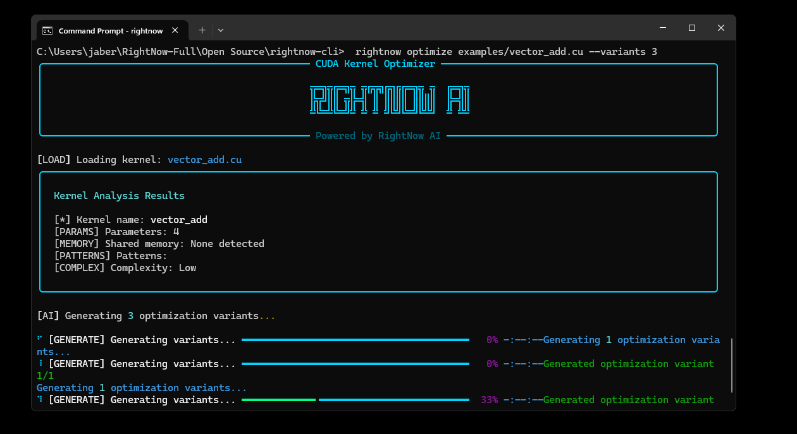

# RightNow CLI

[](https://github.com/RightNow-AI/rightnow-cli/releases)
[](https://python.org)
[](https://developer.nvidia.com/cuda-toolkit)
[](https://discord.com/invite/sSJqgNnq6X)
[](LICENSE)

**AI-powered CUDA kernel optimizer that automatically improves GPU code performance by 20-30x using advanced machine learning models.**

> Part of the [RightNow AI](https://rightnowai.co) ecosystem. Want 180x more powerful AI assistance for your entire codebase? Try [RightNow AI Code Editor](https://rightnowai.co).

## Quick Start

```bash
# Install
git clone https://github.com/RightNow-AI/rightnow-cli.git
cd rightnow-cli
pip install -e .

# Optimize your kernel
rightnow optimize kernel.cu -o kernel_optimized.cu
```

## Demo



## Features

- **AI-Powered Optimization** - Uses GPT-4/Claude to analyze and optimize CUDA kernels
- **Performance Gains** - Average 20-30x speedup on common kernel patterns
- **Smart Analysis** - Automatically detects bottlenecks and optimization opportunities
- **Safety First** - Validates correctness against original implementation
- **Intelligent Caching** - Reuses optimizations for similar kernels
- **Beautiful CLI** - Rich terminal interface with progress tracking

## How It Works


1. **Analysis** - Parses your CUDA kernel to understand patterns and bottlenecks
2. **AI Generation** - Creates multiple optimized variants using ML models
3. **Compilation** - Tests each variant with nvcc for validity
4. **Benchmarking** - Measures performance and selects the fastest
5. **Verification** - Ensures numerical correctness vs original

## Installation

### Requirements

- Python 3.8+
- CUDA Toolkit 11.0+
- NVIDIA GPU (Compute Capability 7.0+)
- OpenRouter API key ([get one here](https://openrouter.ai))

### Setup

```bash
# Clone repository
git clone https://github.com/RightNow-AI/rightnow-cli.git
cd rightnow-cli

# Install dependencies
pip install -e .

# Install dependencies dev
pip install -e ".[dev]"

# Verify installation
rightnow --help
```

## Usage

### Basic Commands

#### Optimize a Kernel
```bash
rightnow optimize kernel.cu [OPTIONS]

Options:
  -o, --output FILE         Output file for optimized kernel
  -v, --variants INT        Number of variants to generate (default: 3)
  -g, --gpu TEXT           Target GPU architecture (e.g., sm_86)
  -f, --force              Force regeneration (ignore cache)
```

#### Analyze Performance
```bash
rightnow analyze kernel.cu [OPTIONS]

Options:
  -v, --verbose            Show detailed analysis
```

#### Configuration
```bash
rightnow config [OPTIONS]

Options:
  --show                   Show current configuration
  --reset-api-key         Reset OpenRouter API key
  --clear-cache           Clear optimization cache
```

### Examples

```bash
# Basic optimization
rightnow optimize vector_add.cu

# Save to specific file
rightnow optimize matrix_mul.cu -o matrix_mul_fast.cu

# Target specific GPU
rightnow optimize kernel.cu --gpu sm_86 --variants 5

# Analyze kernel patterns
rightnow analyze reduction.cu --verbose
```

## Optimization Techniques

RightNow CLI applies state-of-the-art GPU optimization strategies:

| Category | Techniques |
|----------|-----------|
| **Memory** | Coalesced access, shared memory tiling, vectorized loads/stores |
| **Compute** | Loop unrolling, instruction-level parallelism, warp primitives |
| **Architecture** | Tensor cores, async copy, optimal occupancy tuning |

## Performance Results

Typical improvements on common kernel patterns:

- **Matrix Operations**: 25x average (up to 35x)
- **Reductions**: 20x average (up to 28x)
- **Memory-bound**: 15x average (up to 22x)

*Results vary by GPU architecture and kernel complexity*

## Contributing

We welcome contributions! See [CONTRIBUTING.md](CONTRIBUTING.md) for guidelines.

## License

Proprietary license - free for personal/educational use. Commercial usage requires a license.
Contact: jaber@rightnowai.co

## Links

- **Website**: [rightnowai.co](https://rightnowai.co)
- **Documentation**: [docs.rightnowai.co](https://docs.rightnowai.co/)
- **Discord**: [Join our community](https://discord.com/invite/sSJqgNnq6X)
- **Twitter/X**: [@rightnowai_co](https://twitter.com/rightnowai_co)

---

<p align="center">
Made with <3 by the RightNow AI Team<br>
<strong>"Optimize at the speed of thought"</strong>
</p>