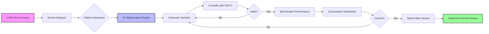

# RightNow CLI Workflow

## Visual Workflow Diagram



## Detailed Process Flow

1. **Input Stage**
   - User provides CUDA kernel file (.cu)
   - Kernel is parsed and validated

2. **Analysis Stage**
   - Extract kernel metadata (name, parameters, patterns)
   - Detect optimization opportunities
   - Calculate complexity metrics

3. **AI Generation Stage**
   - Send kernel + analysis to OpenRouter API
   - Generate N optimization variants
   - Each variant uses different strategies

4. **Compilation Stage**
   - Compile each variant with nvcc
   - Extract register usage and occupancy
   - Filter out invalid kernels

5. **Benchmarking Stage**
   - Run performance tests
   - Measure execution time
   - Profile with CUDA tools

6. **Verification Stage**
   - Compare outputs with original
   - Ensure numerical accuracy
   - Validate correctness

7. **Selection Stage**
   - Rank variants by performance
   - Select fastest correct variant
   - Cache for future use

## Example Flow

```
Input: vector_add.cu
↓
Analysis: Simple elementwise operation, coalesced access
↓
AI: Generate 3 variants (vectorized, unrolled, shared memory)
↓
Compile: All 3 variants compile successfully
↓
Benchmark: Variant 2 (unrolled) is 2.3x faster
↓
Verify: Output matches original exactly
↓
Output: vector_add_optimized.cu (2.3x speedup)
```